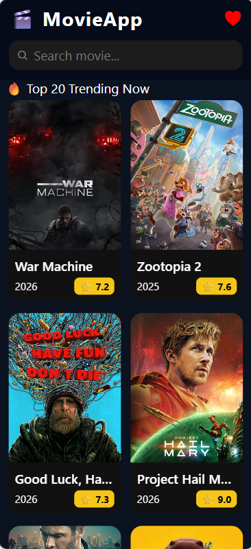

🎬 Movie App

Ứng dụng xem phim được xây dựng bằng React Native (Expo Router), sử dụng TMDB API để hiển thị danh sách phim trending, tìm kiếm phim, xem chi tiết và lưu vào danh sách yêu thích.

🚀 Features

🔥 Hiển thị Top 20 Trending Movies

🔍 Tìm kiếm phim theo tên

📄 Xem chi tiết phim

⭐ Hiển thị điểm đánh giá

❤️ Thêm / Xoá phim khỏi danh sách yêu thích

💾 Lưu danh sách yêu thích bằng AsyncStorage

🎥 Xem trailer YouTube ngay trong app

🛠️ Technologies Used

React Native

Expo Router

TypeScript

TMDB API

AsyncStorage
📌 API Used

Get Trending Movies

Search Movies

Get Movie Detail

Get Movie Trailer

React Navigation

Expo Vector Icons

React Native YouTube Iframe
❤️ Favorite Logic

## 📸 Demo Screenshots

### 🏠 Home Screen

### 📄 Detail Screen

